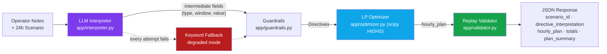
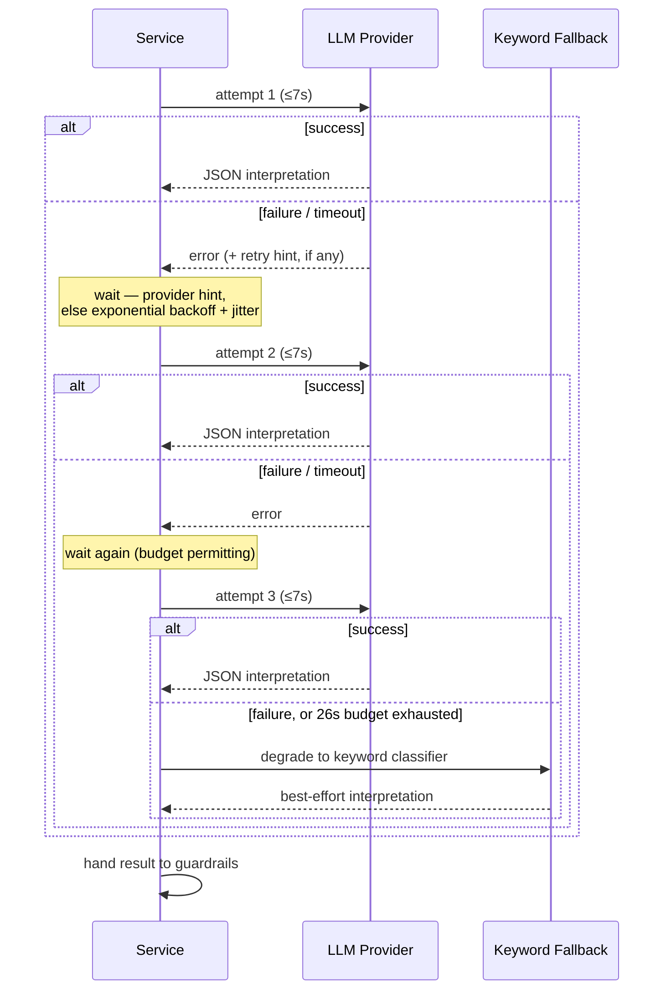

# GridWise LLM

**Smart Campus Energy Optimization · BUP CSE Fest 2026 · Online Preliminary**

An HTTP service that reads a 24-hour campus energy scenario plus 1–3 natural-language
operator notes, interprets those notes with an LLM, deterministically guardrails the
interpretation, solves a least-cost 24-hour grid/solar/battery schedule with a linear
program, and replay-validates its own answer before it ever leaves the service.

> **Live endpoint:** `https://iut-electrolyte-preli.vercel.app`
> **Health check:** `GET /health` · **Main endpoint:** `POST /optimize-energy`

---

## Table of Contents

- [Overview](#overview)
- [Architecture](#architecture)
- [Supported Directives](#supported-directives)
- [API Contract](#api-contract)
- [Environment Variables](#environment-variables)
- [Repository Layout](#repository-layout)
- [Local Quickstart](#local-quickstart)
- [Testing](#testing)
- [Docker Fallback](#docker-fallback)
- [Error Handling & Security](#error-handling--security)
- [Known Limitations](#known-limitations)
- [Dependencies & Credits](#dependencies--credits)

---

## Overview

BUP operates a smart campus drawing electricity from the grid, rooftop solar, and a
battery. Demand, solar availability, and grid tariff are known for the next 24 hours;
operators may additionally send short natural-language notes describing temporary
conditions ("solar output drops to 20% from 1–3 PM", "keep at least 120 kWh in reserve
tonight"). The service must:

1. Understand every note with an LLM — never with hard-coded phrase matching alone.
2. Convert relevant notes into one of six machine-checkable directive types, or `no_op`.
3. Validate that interpretation deterministically before trusting it.
4. Produce a 24-hour schedule that satisfies every applicable directive and the normal
   GridWise energy rules.
5. Minimize total grid electricity cost, *after* correctness is satisfied — a cheap
   schedule that ignores a directive is not a correct answer.

## Architecture



| Stage | File | Responsibility |
|---|---|---|
| **LLM Interpreter** | `app/interpreter.py` | One batched call per request (all notes together), temperature 0, JSON-mode output. Extracts only *intermediate* fields — `directive_type`, `start_hour`/`end_hour`, `value`/`value_kind` — and never does arithmetic itself. Up to 3 attempts with provider-aware backoff (honors `Retry-After` / Gemini `RetryInfo` / Groq rate-limit headers) inside a 26 s wall-clock budget. |
| **Emergency fallback** | `app/interpreter.py` | If every LLM attempt fails (or no key is configured), a deterministic keyword classifier keeps the service answering in the same schema. This is an *availability* safety net, not the graded interpretation path — the LLM is always the primary path when the provider is reachable. |
| **Guardrails** | `app/guardrails.py` | Converts intermediate fields into the exact `structured_adjustment` shape per directive type: end-exclusive hour windows ("1 PM–3 PM" → `[13,14]`), percent/fraction → `factor`, percent-of-capacity → kWh reserve. Rejects out-of-range values. Anything unusable is coerced to a logged `no_op` — nothing is invented, nothing crashes. |
| **LP Optimizer** | `app/optimizer.py` | Builds a linear program over grid / solar / charge / discharge for all 24 hours: energy balance, battery envelope (raised by any active reserve directive), hourly charge/discharge rate limits, grid caps, and end-of-day battery neutrality. Objective: minimize `Σ grid_kwh[h] × tariff[h]`. Solved with SciPy's HiGHS backend, then flows are rounded and recomputed so the returned plan balances exactly rather than only to solver precision. |
| **Replay Validator** | `app/validator.py` | Independently re-derives and checks every rule the judge is expected to check — energy balance, effective-solar bounds, battery physics, directive compliance, end-of-day neutrality, recalculated totals — against the service's *own* response before it is returned. |

### Interpretation retry & fallback flow



All three attempts and every backoff sleep together are capped at a 26 s wall-clock
budget, comfortably inside the judge's 30 s per-request timeout. The keyword fallback
never raises — it always returns a same-shape result, even if that result is a blanket
`no_op`.

### Why this shape

The LLM understands language; deterministic code validates that understanding; the
optimizer does the math. Operator notes are never trusted directly as numeric input —
they pass through the LLM, then guardrails, then the optimizer, then a full replay
check, in that order.

## Supported Directives

| Directive | Meaning | `structured_adjustment` |
|---|---|---|
| `solar_reduction` | Usable solar reduced during specific hours | `{"hours":[...], "factor": <usable fraction remaining>}` |
| `minimum_battery_reserve` | Battery must stay at/above a level during specific hours | `{"hours":[...], "minimum_energy_kwh": <number>}` |
| `no_charge_window` | Charging unavailable during specific hours | `{"hours":[...]}` |
| `no_discharge_window` | Discharging unavailable during specific hours | `{"hours":[...]}` |
| `max_grid_window` | Grid import capped during specific hours | `{"hours":[...], "max_grid_kwh": <number>}` |
| `no_op` | Note does not affect today's schedule (distractor) | `null` |

Time windows are whole-hour and end-exclusive: "1 PM to 3 PM" → hours `[13, 14]`. For
`solar_reduction`, `factor` is the fraction of solar that *remains* — an 80% reduction is
`factor = 0.2`. Hidden notes may paraphrase any of these ("PV output drops to a fifth",
"panel washing leaves roughly 20% output") — the interpreter is expected to generalize,
not pattern-match fixed phrases.

## API Contract

### `GET /health`

```json
{ "status": "ok" }
```

### `POST /optimize-energy`

**Request**

| Field | Type | Notes |
|---|---|---|
| `scenario_id` | string | Echoed back unchanged |
| `operator_notes` | string[1..3] | Natural-language notes, same 24h scenario |
| `hours` | array[24] | `hour`, `demand_kwh`, `solar_kwh`, `tariff_bdt_per_kwh` — one entry per hour 0–23 |
| `battery` | object | `capacity_kwh`, `initial_energy_kwh`, `minimum_energy_kwh`, `max_charge_kwh_per_hour`, `max_discharge_kwh_per_hour` |

```json
{
  "scenario_id": "GRID-101",
  "operator_notes": [
    "Solar output will drop to about 20% from 1 PM to 3 PM.",
    "Do not charge the battery between 2 PM and 4 PM.",
    "The cafeteria menu changes tomorrow."
  ],
  "hours": [
    {"hour": 0, "demand_kwh": 180, "solar_kwh": 0, "tariff_bdt_per_kwh": 7}
    /* ... 23 more hourly entries ... */
  ],
  "battery": {
    "capacity_kwh": 500,
    "initial_energy_kwh": 200,
    "minimum_energy_kwh": 50,
    "max_charge_kwh_per_hour": 100,
    "max_discharge_kwh_per_hour": 100
  }
}
```

**Response**

| Field | Type | Notes |
|---|---|---|
| `scenario_id` | string | Matches the request |
| `directive_interpretation` | array | One entry per note, in `note_index` order: `note_index`, `applies`, `directive_type`, `structured_adjustment`, `explanation` |
| `hourly_plan` | array[24] | `hour`, `grid_kwh`, `solar_used_kwh`, `battery_action` (`charge`\|`discharge`\|`idle`), `battery_kwh`, `battery_energy_after_kwh` |
| `total_grid_kwh` | number | Recalculated from `hourly_plan` |
| `total_cost_bdt` | number | `Σ grid_kwh[h] × tariff_bdt_per_kwh[h]`, recalculated from `hourly_plan` |
| `peak_grid_kwh` | number | Max hourly `grid_kwh`, recalculated from `hourly_plan` |
| `plan_summary` | string | Short human-readable summary of the applied strategy |

```json
{
  "note_index": 0,
  "applies": true,
  "directive_type": "solar_reduction",
  "structured_adjustment": {"hours": [13, 14], "factor": 0.2},
  "explanation": "Solar availability is reduced during panel cleaning."
}
```

**HTTP codes** — `200` success · `400` malformed JSON / structurally invalid request ·
`500` controlled internal error (never a raw stack trace).

## Environment Variables

*(names only — never commit values; `.env` is git-ignored)*

| Variable | Meaning | Default |
|---|---|---|
| `LLM_PROVIDER` | `gemini` \| `openai` \| `groq` | `gemini` |
| `LLM_API_KEY` | Provider API key, supplied at runtime | — |
| `LLM_MODEL` | Model identifier for the chosen provider | `gemini-3.5-flash-lite` |
| `PORT` | HTTP port to bind | `8000` |

## Repository Layout

```
bup_hack/
├── README.md                      ← you are here
├── docker-compose.yml              ← local/registry Docker fallback
└── gridwise-llm-preli/
    ├── app/
    │   ├── main.py                 FastAPI app: /health, /optimize-energy, error handlers
    │   ├── schemas.py              Frozen request/response contract (pydantic models)
    │   ├── interpreter.py          LLM call + prompt + fallback keyword classifier
    │   ├── guardrails.py           Deterministic validation & normalization of LLM output
    │   ├── optimizer.py            LP formulation (scipy HiGHS) + rounding/recompute
    │   ├── validator.py            Independent replay check of the final plan
    │   ├── engine_api.py           Frozen seam between interpretation and optimization
    │   └── config.py               Environment loading
    ├── tests/
    │   ├── run_public_cases.py     Engine-only or full HTTP harness against any base URL
    │   ├── full_report.py          Full-visibility run: latency, LLM-vs-fallback, raw responses
    │   ├── test_engine_soak.py     300 random + edge scenarios against the optimizer directly
    │   ├── test_validator_rejects.py  Confirms the validator rejects hand-broken plans
    │   ├── extra_cases.json        Hand-authored edge cases (directive merges, windows, ambiguity)
    │   ├── judge_cases.json        Judge-style pack: paraphrases, edges, multi-directive combos
    │   └── stress_case.json        Single large stress scenario
    ├── sample_cases.json           10 official public reference cases
    ├── Dockerfile                  Fallback execution image
    └── requirements.txt
```

## Local Quickstart

```bash
git clone <this repository>
cd gridwise-llm-preli
python -m venv .venv && source .venv/bin/activate      # Windows: .venv\Scripts\activate
pip install -r requirements.txt

export LLM_API_KEY=<your key>                           # Windows: set LLM_API_KEY=<your key>
uvicorn app.main:app --host 0.0.0.0 --port 8000
```

```bash
curl http://localhost:8000/health
# {"status":"ok"}
```

One sample request (SAMPLE-01 from the public case pack):

```bash
python - <<'EOF' > /tmp/sample01.json
import json; print(json.dumps(json.load(open("sample_cases.json"))["cases"][0]["input"]))
EOF
curl -s -X POST http://localhost:8000/optimize-energy \
     -H "Content-Type: application/json" -d @/tmp/sample01.json
```

Expected shape: `scenario_id` echo, one `directive_interpretation` entry per note in
`note_index` order, a 24-entry `hourly_plan`, and recalculated
`total_grid_kwh` / `total_cost_bdt` / `peak_grid_kwh` (SAMPLE-01 optimal cost: 38365 BDT).

## Testing

```bash
# Engine only — no LLM, no network: optimizer + validator against the 10 public cases
python tests/run_public_cases.py --engine-only

# Full end-to-end against a running service (schema, interpretation semantics,
# ground-truth replay, totals, cost vs. reference, paraphrase + robustness checks)
python tests/run_public_cases.py --base-url http://localhost:8000

# Same harness, against the deployed endpoint
python tests/run_public_cases.py --base-url https://iut-electrolyte-preli.vercel.app

# Extended edge-case and judge-style packs (same harness, different case files)
python tests/run_public_cases.py --base-url <base-url> --cases tests/extra_cases.json
python tests/run_public_cases.py --base-url <base-url> --cases tests/judge_cases.json
```

Expected result: a PASS table ending `N/N checks passed`, exit code 0.

Additional suites:

- `tests/test_validator_rejects.py` — confirms the replay validator rejects hand-broken
  plans (energy-balance violations, rate-limit breaches, reserve/cap violations, etc.).
- `tests/test_engine_soak.py` — 300 randomized scenarios + 7 hand-picked edge cases run
  directly against the optimizer + validator, with no network involved.
- `tests/full_report.py` — full-visibility run against a live service: records latency
  per case, detects whether each response came from the LLM path or the emergency
  keyword fallback (by watching the service log), and saves every raw response for
  inspection.

## Docker Fallback

- **Registry reference:** `nfs996/iut-electrolyte-preli:v1`
- **Digest:** `sha256:74ea68c6f0677524d1d55e6407c33c8e0f6d9357dda84284e26e2a1e50691c43`

```bash
docker pull nfs996/iut-electrolyte-preli:v1
docker run -d --name gridwise-fallback -p 8000:8000 \
  -e LLM_API_KEY=<your key> \
  nfs996/iut-electrolyte-preli:v1

curl http://localhost:8000/health
# {"status":"ok"}
```

The image binds `0.0.0.0`, exposes port `8000` (override with `-e PORT=...`), and
contains **no baked-in credentials** — the key is supplied at `docker run` time.
A `docker-compose.yml` at the repository root wires up the same image with the full
environment-variable set for local orchestration.

## Error Handling & Security

- Malformed JSON or a structurally invalid body → HTTP `400` with a short JSON error.
  Unexpected internal failures → controlled `500` (`{"error": "internal error"}`); stack
  traces are never returned to callers.
- LLM/provider failures never take the service down: up to 3 attempts with
  provider-aware backoff, then a deterministic keyword fallback answers in the same
  schema so the request still completes.
- The provider API key is sent in a request header (never in a URL), log messages are
  defensively scrubbed of the key, `.env` is git-ignored, and no secrets exist in the
  repository or the Docker image.

## Known Limitations

- The keyword fallback recognizes common phrasings only; it is an availability safety
  net, not the graded interpretation path — that is always the LLM when the provider is
  reachable.
- If a directive set were genuinely infeasible, the optimizer relaxes the most likely
  misread directive family and logs it rather than failing the request outright.
  Organizer scoring scenarios are guaranteed feasible, so this path is not expected
  during judging.
- Grid export/sell-back is out of scope per the problem statement; surplus solar is
  curtailed rather than exported.

## Dependencies & Credits

FastAPI, uvicorn, pydantic (API + validation) · scipy/numpy (HiGHS linear programming) ·
httpx (async LLM calls) · Google Gemini API (operator-note interpretation, with OpenAI-
and Groq-compatible providers also supported). AI coding assistants were used during
development per the official rulebook; the core architecture and logic are the team's
own.
